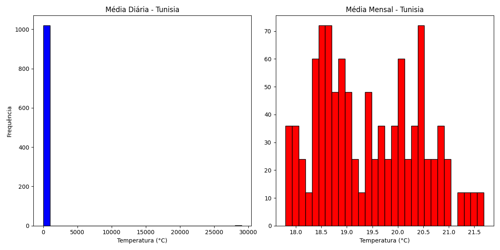
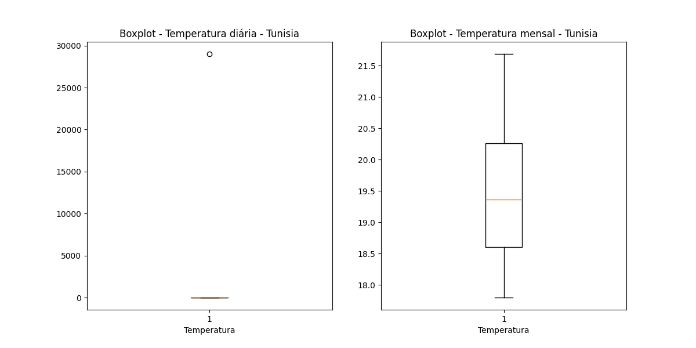
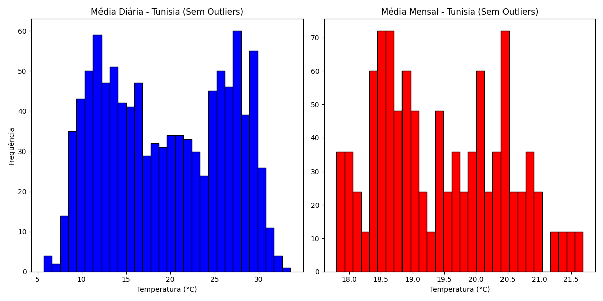
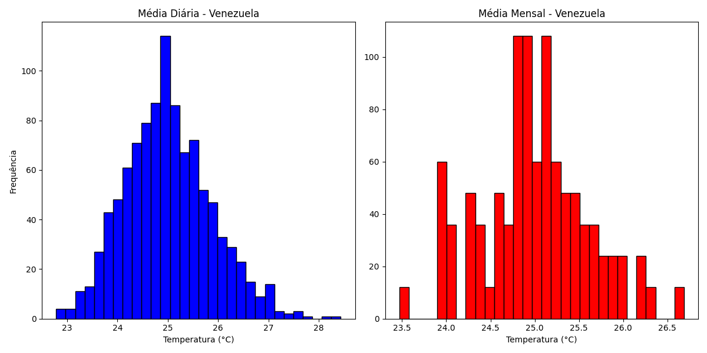
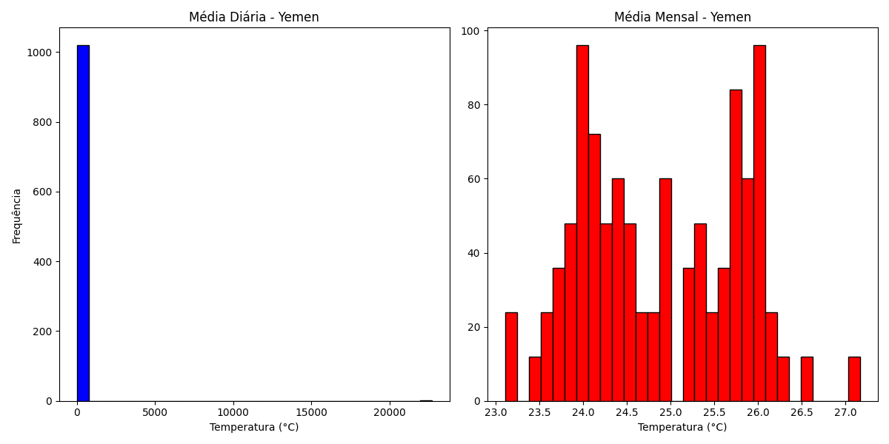
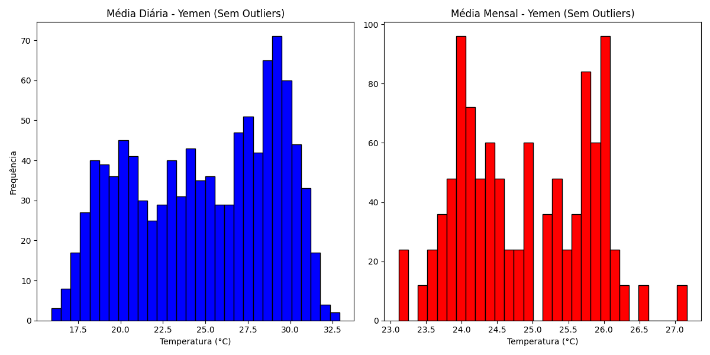
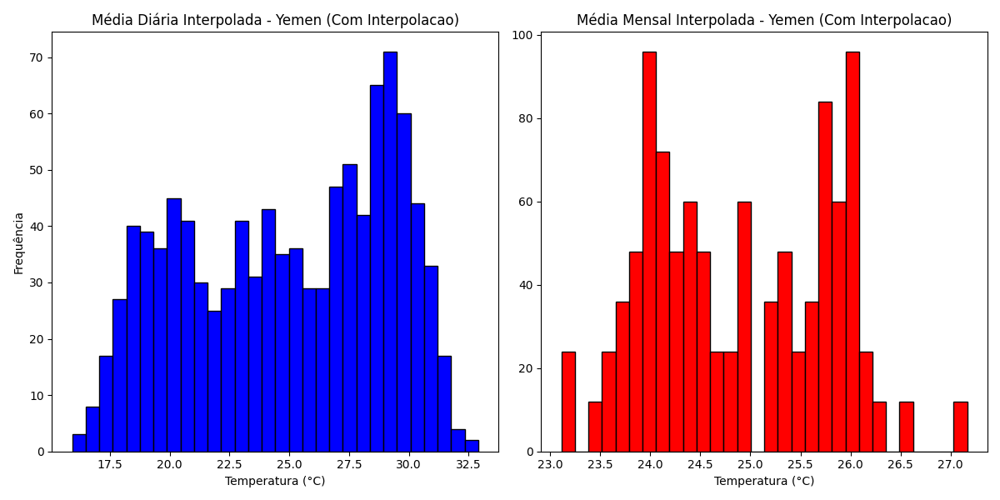

# 📊 Análise de Temperatura por País 🌍

Este projeto em Python analisa dados de temperatura superficial de diferentes países (Tunísia, Venezuela, Iémen), identificando e tratando **outliers** nos dados. O objetivo principal é gerar gráficos como **histogramas** e **boxplots**, além de permitir o tratamento de dados ausentes através de **interpolação**.

## 🚀 Autor
- [Matheus Cunha Prado](https://github.com/MathCunha16)

## 📂 Estrutura do Projeto

```
AnaliseTemperaturaPaises/
├── src/                    # Arquivos Python
│   ├── FuncoesGraficas.py  # Funções compartilhadas para visualização
│   ├── AnaliseTunisia.py   # Análise específica da Tunísia
│   ├── AnaliseVenezuela.py # Análise específica da Venezuela
│   └── AnaliseYemen.py     # Análise específica do Iémen
│
├── data/                   # Arquivos de dados
│   └── average-monthly-surface-temperature.csv
│
├── resultados/             # Pasta para as imagens geradas
│   └── (arquivos de imagem)
│
└── .gitignore
```

## ⚙️ Funcionalidades

- **📈 Geração de Histogramas**: Para análise de distribuição de temperaturas diárias e mensais.
- **🧮 Identificação de Outliers**: Usando o método **IQR** (Intervalo Interquartílico).
- **📊 Geração de Boxplots**: Para visualização gráfica dos outliers.
- **🧹 Limpeza de Dados**: Remoção de outliers identificados nos dados.
- **🔄 Interpolação de Dados**: Preenchimento de dados ausentes usando interpolação linear.

## 🚦 Como Executar

1. Entre na pasta `src`:

```bash
cd src
```

2. Execute o arquivo desejado para o país correspondente:

```bash
python AnaliseTunisia.py
python AnaliseVenezuela.py
python AnaliseYemen.py
```

## 📦 Dependências

- pandas
- matplotlib

## 🛠️ Descrição dos Métodos

### `gerar_histogramas(pais, dados_pais)`

Esta função gera dois histogramas para o país especificado:

- **Histograma de Temperaturas Diárias**: Exibe a distribuição das temperaturas diárias.
- **Histograma de Temperaturas Mensais**: Exibe a distribuição das temperaturas mensais.

### `identificar_outliers(coluna)`

Identifica **outliers** nas colunas de temperatura, usando o método **IQR**:

- Calcula o 1º quartil (Q1) e o 3º quartil (Q3).
- Calcula o intervalo interquartílico (IQR = Q3 - Q1).
- Estabelece os limites inferiores e superiores, sendo qualquer valor fora desses limites considerado um outlier.

### `remover_outliers(dados)`

Remove os **outliers** identificados na coluna de dados de temperatura. Usa os limites calculados pela função `identificar_outliers()` para filtrar os dados e eliminar valores que estão fora desses limites.

### `gerar_boxplot(pais, dados_pais)`

Gera um **boxplot** para as temperaturas diárias e mensais do país. O boxplot é útil para visualizar a distribuição dos dados, incluindo a presença de **outliers**.

### `analisar_periodo(dataframe, coluna_data)`

Analisa o **período de dados**, extraindo o primeiro e o último mês de registros. Converte a coluna de datas para o formato datetime e extrai o ano e o mês.

### `identificar_meses_faltantes(dataframe, coluna_data)`

Verifica se há **meses faltantes** nos dados. Compara os meses presentes no conjunto de dados com a lista de meses esperados e exibe os meses ausentes, se houver.

### `interpolar_dados(dataframe)`

Realiza **interpolação linear** para preencher os valores ausentes nas colunas de temperatura diária e mensal.

### `gerar_histogramas_interpolados(pais, dados_pais)`

Gera histogramas das temperaturas diárias e mensais para os dados já **interpolados**, ajudando a visualizar o impacto da interpolação nos dados.

## 📊 Como os Métodos São Usados no Código

### Para a Tunísia

1. **Análise Inicial**:
   - Filtra os dados da **Tunísia**.
   - Gera histogramas com os dados brutos, identificando **outliers**.
   - Usa `identificar_outliers` para encontrar e listar os outliers.
   - Gera um **boxplot** para visualizar a distribuição dos dados.

2. **Remoção de Outliers**:
   - Usando `remover_outliers`, a função elimina os outliers encontrados nas temperaturas diárias e mensais.
   - Gera novos histogramas para visualizar a distribuição sem os outliers.

3. **Tratamento de Dados Ausentes**:
   - A função `analisar_periodo` é usada para verificar o intervalo de tempo dos dados.
   - `identificar_meses_faltantes` é usada para verificar se há meses ausentes.
   - Dados ausentes são preenchidos com **interpolação** usando a função `interpolar_dados`.
   - Finalmente, histogramas interpolados são gerados para comparar com os dados originais.

### Para a Venezuela

1. **Análise Inicial**:
   - Similar à Tunísia, os dados da **Venezuela** são filtrados e histogramas são gerados.
   - O método de identificação de **outliers** é aplicado, mas a análise conclui que não há outliers significativos, então nenhum dado é removido.

2. **Tratamento de Dados Ausentes**:
   - A função `analisar_periodo` identifica o período de dados.
   - `identificar_meses_faltantes` confirma que não há meses ausentes na Venezuela.
   - Nenhuma interpolação de dados é necessária, pois todos os dados estão completos.

### Para o Iémen

1. **Análise Inicial**:
   - O mesmo processo é seguido: dados filtrados, histogramas e **boxplots** gerados.
   - **Outliers** são identificados e removidos das temperaturas diárias e mensais.

2. **Tratamento de Dados Ausentes**:
   - A função `analisar_periodo` encontra o período de dados.
   - `identificar_meses_faltantes` é usada para verificar se há meses ausentes.
   - Os dados ausentes são preenchidos com **interpolação** e histogramas são gerados para visualizar as diferenças.

## 📸 Resultados Gerados

### 🏖️ **Tunísia**

1. **Histograma com Outliers**:
   

2. **Boxplot identificando os Outliers**:
   

3. **Histograma após remoção dos Outliers**:
   

4. **Histograma com Interpolação**:
   

**Outliers Identificados**:
- Temperatura Diária: [29009.0]
- Temperatura Mensal: [ ]

### 🌍 **Venezuela**

1. **Histograma (não contém nenhum outlier)**:
   

### 🇴🇲 **Iémen**

1. **Histograma com Outliers**:
   

2. **Boxplot identificando os Outliers**:
   

3. **Histograma após remoção dos Outliers**:
   

4. **Histograma com Interpolação**:
   

**Outliers Identificados**:
- Temperatura Diária: [22715.0]
- Temperatura Mensal: [ ] 

---

## 🏁 Conclusão

Este projeto oferece uma análise detalhada das **temperaturas superficiais** de diferentes países, incluindo a identificação e o tratamento de **outliers**, visualização gráfica com **histogramas** e **boxplots**, além de permitir o preenchimento de **dados ausentes**. Através da **interpolação**, o projeto é capaz de melhorar a qualidade dos dados para análises mais precisas.